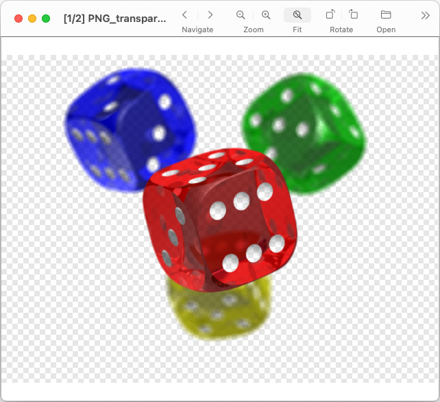

# Image Viewer

## Description

Simple, cross-platform image viewer inspired by [GPicView](http://lxde.sourceforge.net/gpicview/).

Features:
* Just a viewer, not an editor or organizer;
* Support a large number of image formats;
* Support an embedded ICC Profiles;
* Support EXIF, XMP and other metadata;
* Lightweight and fast;
* Very suitable for default image viewer of desktop system;
* Simple and intuitive interface;
* Cross platform: GNU/Linux, macOS, Windows, Haiku and other systems;
* Minimal external lib dependency: only pure Qt and system libraries are used;
* Flexible and configurable;
* Desktop independent: doesn't require any specific desktop environment;
* Open source, licensed under GNU GPL v3 or later;

## Screenshots




## Building

### Requirements

Minimal configuration:
* Qt 4.4 or later
* GCC 3.4 or later

Full configuration:
* Qt 6.2 or later
* Modern GCC, Clang or MSVC compiler with C++17 support

### Building with bundled libraries example (Ubuntu 24.04)

```bash
sudo apt-get install git g++ make qt6-base-dev libqt6svg6-dev \
    qt6-image-formats-plugins
git clone https://github.com/AlienCowEatCake/ImageViewer.git
cd ImageViewer
mkdir build
cd build
qmake6 CONFIG+="release" -r ../ImageViewer.pro
make
cp -a src/ImageViewer/ImageViewer /path/to/install/
```

### Building with all system libraries example (Ubuntu 24.04)

```bash
sudo apt-get install git g++ make qt6-base-dev libqt6svg6-dev \
    qt6-image-formats-plugins \
    zlib1g-dev liblcms2-dev libexif-dev libexiv2-dev libjpeg-dev \
    libmng-dev libpng-dev libjbig-dev liblerc-dev libtiff-dev \
    libwebp-dev libwmf-dev libopenjp2-7-dev libgif-dev libraw-dev \
    librsvg2-dev libheif-dev libopenexr-dev libavif-dev libjxr-dev \
    libjxl-dev
git clone https://github.com/AlienCowEatCake/ImageViewer.git
cd ImageViewer
mkdir build
cd build
qmake6 CONFIG+="release system_thirdparty" \
    CONFIG+="disable_libjasper disable_libbpg disable_flif" \
    INCLUDEPATH+="/usr/include/jxrlib" \
    -r ../ImageViewer.pro
make
cp -a src/ImageViewer/ImageViewer /path/to/install/
```

### Other building examples

See the [buildscripts/](buildscripts/) directory.

### Configuration options

**Languages Configuration:**
* C++11 options: `disable_cxx11`, `enable_cxx11` *(auto by default)*
* C++14 options: `disable_cxx14`, `enable_cxx14` *(auto by default)*
* C++17 options: `disable_cxx17`, `enable_cxx17` *(auto by default)*

**Third Party Components Configuration Presets:**
* `disable_thirdparty` - disable all third party components, extra small and fast build for UI or installer debugging
* `system_thirdparty` - disable all bundled packages and switch to system versions of third party components

**System Libraries Configuration:**
* pkg-config options: `disable_pkgconfig`, `enable_pkgconfig` *(auto by default)*  
  Enable it if you want to use pkg-config for searching system dependencies.
* ZLib options: `disable_zlib`, `system_zlib` *(bundled package by default)*  
  ZLib is used for reading compressed file formats like SVGZ or WMZ.
* Zstandard options: `disable_zstd`, `system_zstd` *(bundled package by default)*  
  This is a transitive dependency. It isn't required if system libraries are used.
* XZUtils options: `disable_xzutils`, `system_xzutils` *(bundled package by default)*  
  This is a transitive dependency. It isn't required if system libraries are used.
* brotli options: `disable_brotli`, `system_brotli` *(bundled package by default)*  
  This is a transitive dependency. It isn't required if system libraries are used.
* highway options: `disable_highway`, `system_highway` *(bundled package by default)*  
  This is a transitive dependency. It isn't required if system libraries are used.
* libexpat options: `disable_libexpat`, `system_libexpat` *(bundled package by default)*  
  This is a transitive dependency. It isn't required if system libraries are used.
* libyuv options: `disable_libyuv`, `system_libyuv` *(bundled package by default)*  
  This is a transitive dependency. It isn't required if system libraries are used.
* LCMS options: `disable_liblcms2`, `system_liblcms2` *(bundled package by default)*  
  LCMS is used for support an embedded ICC Profiles.
* libexif options: `disable_libexif`, `system_libexif` *(bundled package by default)*  
  Libexif is used for support EXIF metadata. It can be used together with exiv2.
* exiv2 options: `disable_exiv2`, `system_exiv2` *(bundled package by default)*  
  Exiv2 is used for support EXIF, XMP and IPTC metadata. It can be used together with libexif.
* LibJPEG options: `disable_libjpeg`, `system_libjpeg` *(bundled package by default)*  
  LibJPEG is used for reading JPEG files.
* LibJasPer options: `disable_libjasper`, `system_libjasper` *(bundled package by default)*  
  LibJasPer is used for reading JPEG 2000 files.  
  Please note that LibJasPer versions older than 4.x has multiple security and crash bugs.
* libmng options: `disable_libmng`, `system_libmng` *(bundled package by default)*  
  Libmng is used for reading MNG files.
* libpng options: `disable_libpng`, `system_libpng` *(bundled package by default)*  
  Libpng is used for reading PNG files.
* jbigkit options: `disable_jbigkit`, `system_jbigkit` *(bundled package by default)*  
  Jbigkit is used for reading JBIG1 files.
* LERC options: `disable_lerc`, `system_lerc` *(bundled package by default)*  
  LERC is used for reading LERC files.
* libtiff options: `disable_libtiff`, `system_libtiff` *(bundled package by default)*  
  Libtiff is used for reading TIFF files.
* LibWebP options: `disable_libwebp`, `system_libwebp` *(bundled package by default)*  
  LibWebP is used for reading WebP files.
* libbpg options: `disable_libbpg`, `system_libbpg` *(bundled package by default)*  
  Libbpg is used for reading BPG files.
* FreeType options: `disable_freetype`, `system_freetype` *(bundled package by default)*  
  This is a transitive dependency. It isn't required if system libraries are used.
* libwmf options: `disable_libwmf`, `system_libwmf` *(bundled package by default)*  
  Libwmf is used for reading WMF files.
* OpenJPEG options: `disable_openjpeg`, `system_openjpeg` *(bundled package by default)*  
  OpenJPEG is used for reading JPEG 2000 files.
* GIFLIB options: `disable_giflib`, `system_giflib` *(bundled package by default)*  
  GIFLIB is used for reading GIF files.
* LibRaw options: `disable_libraw`, `system_libraw` *(bundled package by default)*  
  LibRaw is used for reading RAW files generated by digital photo cameras.
* libRSVG options: `disable_librsvg`, `enable_librsvg`, `system_librsvg` *(system package by default for `system_thirdparty`, disabled by default otherwise)*  
  LibRSVG is used for reading SVG files. You can safely enable it on most Unix-like systems.
* resvg options: `disable_resvg`, `enable_resvg`, `system_resvg` *(disabled by default)*  
  Resvg is used for reading SVG files. Version 0.33 or later is recommended.  
  Please note that resvg has unstable API and ABI, so safe upgrade for resvg isn't possible without application rebuild.
* aom options: `disable_aom`, `system_aom` *(bundled package by default)*  
  This is a transitive dependency. It isn't required if system libraries are used.
* libde265 options: `disable_libde265`, `system_libde265` *(bundled package by default)*  
  This is a transitive dependency. It isn't required if system libraries are used.
* libheif options: `disable_libheif`, `system_libheif` *(bundled package by default)*  
  Libheif is used for reading HEIF and AVIF files.
* OpenEXR options: `disable_openexr`, `system_openexr` *(bundled package by default)*  
  OpenEXR is used for reading EXR files.
* libavif options: `disable_libavif`, `system_libavif` *(bundled package by default)*  
  Libavif is used for reading AVIF files.
* FLIF options: `disable_flif`, `system_flif` *(bundled package by default)*  
  FLIF is used for reading FLIF files.
* jxrlib options: `disable_jxrlib`, `system_jxrlib` *(bundled package by default)*  
  Jxrlib is used for reading JPEG XR files.
* libjxl options: `disable_libjxl`, `system_libjxl` *(bundled package by default)*  
  Libjxl is used for reading JPEG XL files.
* MagickCore options: `disable_magickcore`, `enable_magickcore` *(disabled by default)*  
  MagickCore is used for reading many different file formats.  
  This component is experimental and not recommended for routine use.
* MagickWand options: `disable_magickwand`, `enable_magickwand`, `system_magickwand` *(disabled by default)*  
  MagickWand is used for reading many different file formats.  
  This component is experimental and not recommended for routine use.
* GraphicsMagick options: `disable_graphicsmagick`, `enable_graphicsmagick` *(disabled by default)*  
  GraphicsMagick is used for reading many different file formats.  
  This component is experimental and not recommended for routine use.
* GraphicsMagickWand options: `disable_graphicsmagickwand`, `enable_graphicsmagickwand`, `system_graphicsmagickwand` *(disabled by default)*  
  GraphicsMagickWand is used for reading many different file formats.  
  This component is experimental and not recommended for routine use.

**Optional Third Party Components Configuration:**
* QtExtended options: `disable_qtextended`, `enable_qtextended` *(disabled by default)*  
  QtExtended is used for support EXIF metadata. There is no reason to enable it together with libexif or exiv2.  
  Please note that QtExtended is incompatible with Qt 6.x and later.
* STB options: `disable_stb` *(enabled by default)*  
  STB is used for reading many different file formats.
* NanoSVG options: `disable_nanosvg`, `enable_nanosvg` *(disabled by default)*  
  NanoSVG is used for reading SVG files. There is no reason to enable it together with any other SVG reader.
* J40 options: `disable_j40`, `enable_j40` *(disabled by default)*  
  J40 is used for reading JPEG XL files. There is no reason to enable it together with libjxl.
* QtImageFormats options: `disable_qtimageformats` *(enabled by default)*  
  QtImageFormats is used for reading many different file formats.   
  Disable it if you want to use system libraries, because QtImageFormats should be installed as Qt plugins.  
  Please note that bundled QtImageFormats is incompatible with Qt 4.x.
* KImageFormats options: `disable_kimageformats` *(enabled by default)*  
  KImageFormats is used for reading many different file formats.  
  Disable it if you want to use system libraries, because KImageFormats should be installed as Qt plugins.  
  Please note that bundled KImageFormats is incompatible with Qt 5.14.x and earlier.
* MSEdgeWebView2 options: `disable_msedgewebview2`, `enable_msedgewebview2` *(disabled by default)*  
  MSEdgeWebView2 is used for reading SVG files via Microsoft Edge WebView2 (Windows only).

**Optional Built-in Components Configuration:**
* DecoderQtSVG options: `disable_qtsvg` *(enabled by default)*  
  DecoderQtSVG is used for reading SVG files via QtSVG.
* DecoderQtWebKit options: `disable_qtwebkit`, `enable_qtwebkit` *(disabled by default)*  
  DecoderQtWebKit is used for reading SVG files via QtWebKit.  
  Please note that QtWebKit was removed from official Qt since 5.6 and build from source is incompatible with Qt 6.x and later.
* DecoderQtWebEngine options: `disable_qtwebengine`, `enable_qtwebengine` *(disabled by default)*  
  DecoderQtWebEngine is used for reading SVG files via QtWebEngine.  
  This component is experimental and not recommended for routine use.  
  Please note that DecoderQtWebEngine is incompatible with Qt 5.3.x and earlier.
* DecoderQMLWebEngine options: `disable_qmlwebengine`, `enable_qmlwebengine` *(disabled by default)*  
  DecoderQMLWebEngine is used for reading SVG files via QMLWebEngine.  
  This component is experimental and not recommended for routine use.  
  Please note that DecoderQMLWebEngine is incompatible with Qt 5.3.x and earlier.
* DecoderMSHTML options: `disable_mshtml`, `enable_mshtml` *(disabled by default)*  
  DecoderMSHTML is used for reading SVG files via MSHTML 9.0 and later (Windows only).
* DecoderWIC options: `disable_wic` *(enabled by default for Windows)*  
  DecoderWIC is used for reading many different file formats via Windows Imaging Component (Windows only).
* DecoderNSImage options: `disable_nsimage` *(enabled by default for macOS)*  
  DecoderNSImage is used for reading many different file formats via NSImage from AppKit Framework (macOS only).
* DecoderMacWebView options: `disable_macwebview`, `enable_macwebview` *(disabled by default)*  
  DecoderMacWebView is used for reading SVG files via WebView from WebKit Framework (macOS only).  
  This component uses deprecated API and not recommended for routine use.
* DecoderMacWKWebView options: `disable_macwkwebview`, `enable_macwkwebview` *(disabled by default)*  
  DecoderMacWKWebView is used for reading SVG files via WKWebView from WebKit Framework (macOS only).  
  This component uses private undocumented API and not recommended for routine use.
* MacToolBar options: `disable_mactoolbar` *(enabled by default for macOS)*  
  MacToolBar is used for support a native toolbar on Mac (macOS only).  
  Please note that MacToolBar requires Cocoa version of Qt and incompatible with Carbon version of Qt.
* MacTouchBar options: `disable_mactouchbar` *(enabled by default for macOS)*  
  MacTouchBar is used for support a Touch Bar on Mac (macOS only).  
  Please note that MacTouchBar requires MacOS X SDK 10.12.2 or later.
* Print Support options: `disable_printsupport` *(enabled by default)*  
  Disable it if you don't want to use printing features.
* Fallback ICC Profiles options: `disable_fallback_iccprofiles` *(enabled by default)*  
  Fallback ICC Profiles are used for opening non-RGB images without embedded color profiles.  
  Disable it if you don't want to open these images or you want try to use system ICC profiles.
* QtCore5Compat options: `disable_qtcore5compat`, `enable_qtcore5compat` *(disabled by default)*  
  Enable it if you use Qt 6.x without ICU and you want to open non-UTF-8 SVG files.
* Updater options: `enable_update_checking` *(disabled by default)*  
  Enable it if you want to use built-in update checker.

